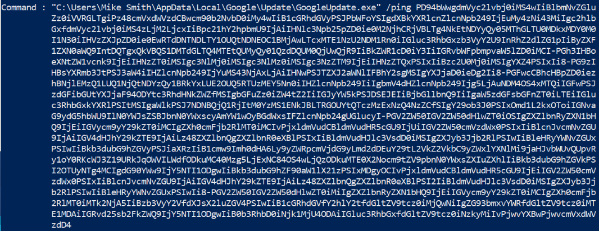
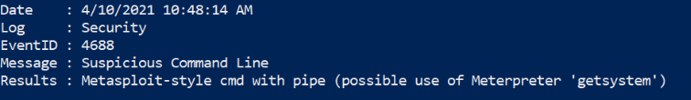
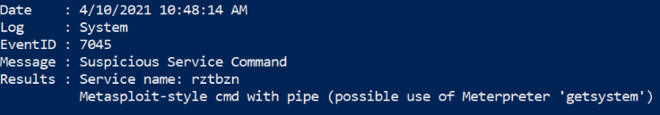
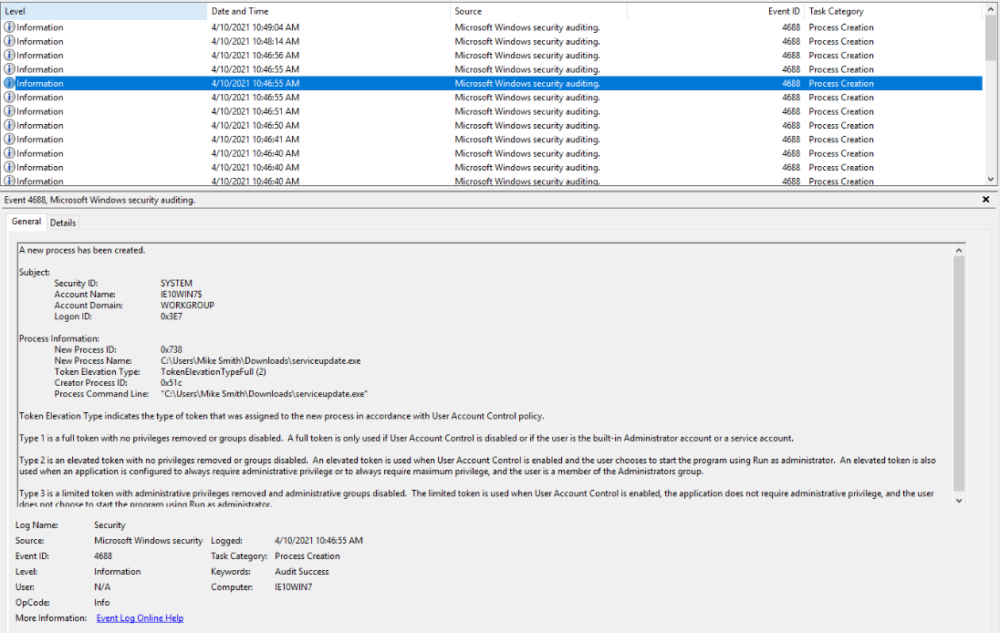
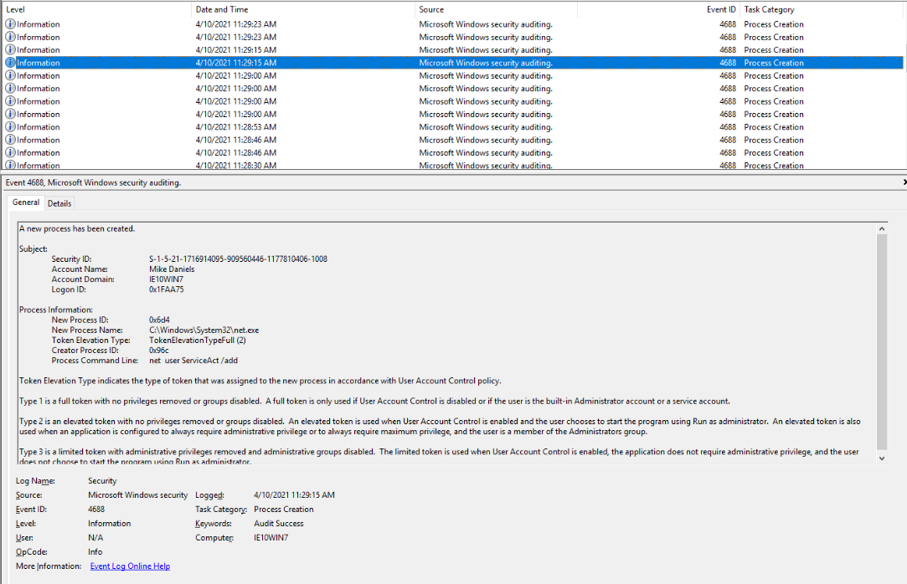
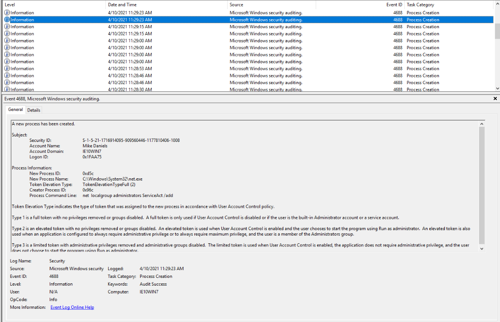
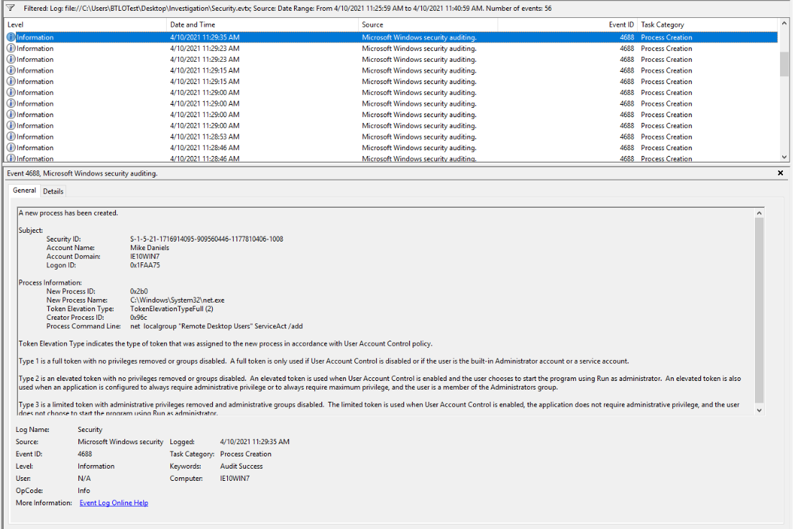

# Question 1) Using DeepBlueCLI, investigate the recovered Security log (Security.evtx). Which user account ran GoogleUpdate.exe? 

Navigating to DeepBlue CLI folder, excute: .\DeepBlue.ps1 ..\Security.evtx

Answer: Mike Smith

# Question 2) Using DeepBlueCLI investigate the recovered Security.evtx log. At what time is there likely evidence of Meterpreter activity?

Answer: 04/10/2021 10:48:14

# Question 3) Using DeepBlueCLI investigate the recovered System.evtx log. What is the name of the suspicious service created?

Answer: rztbzn

# Question4) Investigate the Security.evtx log in Event Viewer. Process creation is being audited (event ID 4688). Identify the malicious executable downloaded that was used to gain a Meterpreter reverse shell, between 10:30 and 10:50 AM on the 10th of April 2021.

A serviceupdate.exe was placed in the Downloads folder seems suspicious

Answer: Mike Smith, ServiceUpdate.exe

# Question 5) It's also believed that an additional account was created to ensure persistence between 11:25 AM and 11:40 AM on the 10th April 2021. What was the command line used to create this account? (Make sure you've found the right account!) 

Answer: net user ServiceAct /add

# Question 6) What two local groups was this new account added to?

Answer: administrators, remote desktop users