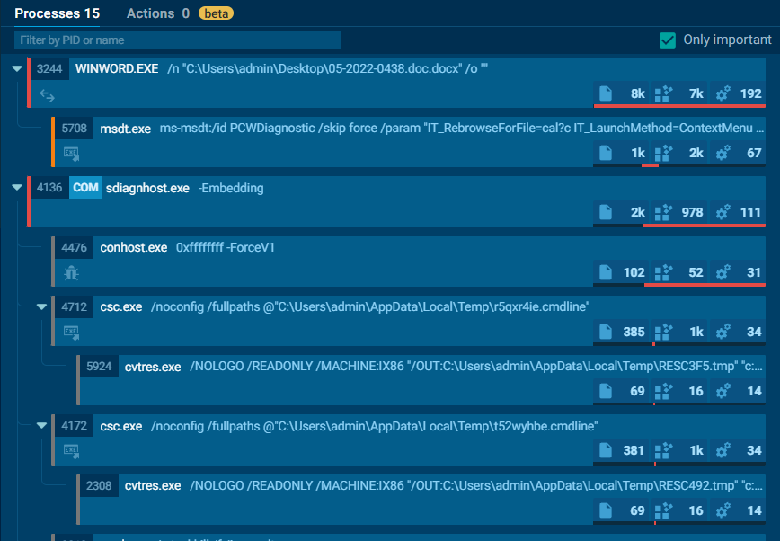
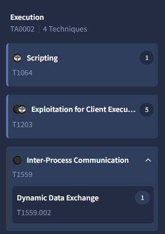

# Question 1) What is the SHA1 hash value of the sample?

Uploaded `sample.doc` to VirusTotal to retrieve its SHA1 hash digest.

![[img1.png]]

Answer: 06727ffda60359236a8029e0b3e8a0fd11c23313

# Question 2) According to VirusTotal, what is the full filetype of the provided sample?

From the VirusTotal scan results above, the file type is identified.

Answer: Office Open XML Document

# Question 3) Extract the URL that is used within the sample and submit it

From VirusTotal, I retrieved several URLs embedded in the document:

![[img2.png]]

Based on the required format (https://x.domain.tld/path/to/something) and the context of the Follina exploit, the malicious URL that triggers the vulnerability is the one pointing to the HTML file that invokes MSDT.

Answer: https://www.xmlformats.com/office/word/2022/wordprocessingDrawing/RDF842l.html

# Question 4) What is the name of the XML file that is storing the extracted URL?

To find which XML file contains the extracted URL, I first attempted to dump `sample.doc` to strings and search for "RDF842l.html" but found nothing.

![[img3.png]]

Then I tried using `catdoc` to extract text:

![[img4.png]]

Since Office documents are ZIP archives, I unzipped the file and searched through the XML structure. The URL was found in the relationships file:

![[img5.png]]
![[img6.png]]

Answer: document.xml.rels

# Question 5) The extracted URL accesses a HTML file that triggers the vulnerability to execute a malicious payload. According to the HTML processing functions, any files with fewer than <Number> bytes would not invoke the payload

Attempted to access the URL, but the server is down. After researching CVE-2022-30190 (Follina), I found relevant technical analysis from multiple sources:

- https://asec.ahnlab.com/en/34998/
- https://www.deepwatch.com/labs/customer-advisory-microsoft-office-used-to-exploit-follina-cve-2022-30190-an-rce-vulnerability-in-microsofts-support-diagnostic-tool/
- https://www.huntress.com/blog/microsoft-office-remote-code-execution-follina-msdt-bug

These resources indicate that the HTML processing function requires a minimum file size of 4096 bytes for the payload to execute. Files smaller than this threshold will not trigger the exploit

Answer: 4096

# Question 6) After execution, the sample will try to kill a process if it is already running. What is the name of this process?

Since the malicious URL is no longer available, I performed OSINT and found an Any.Run sandbox analysis of the same sample:

https://app.any.run/tasks/713f05d2-fe78-4b9d-a744-f7c133e3fafb/

Examining the process tree, the malware attempts to kill any existing instances of the Microsoft Support Diagnostic Tool process before executing its payload.

![[img7.png]]

Answer: msdt.exe

# Question 7) You were asked to write a process-based detection rule using Windows Event ID 4688. What would be the ProcessName and ParentProcessname used in this detection rule?

Event ID 4688 signifies that a new process has been created on a Windows system. Continuing with the Any.Run sandbox sample:

From the process tree, I found a suspicious parent and child process relationship. Normally, Microsoft Word (WINWORD.EXE) rarely executes the Diagnostic Tool (msdt.exe).

Answer: msdt.exe, WINWORD.EXE

# Question8) Submit the MITRE technique ID used by the sample for Execution

Going back to VirusTotal, under the Behavior tab:

After examining the behavior patterns, I identified the MITRE technique used.

Answer: T1559

# Question 9) Submit the CVE associated with the vulnerability that is being exploited

Answer: cve-2022-30190

