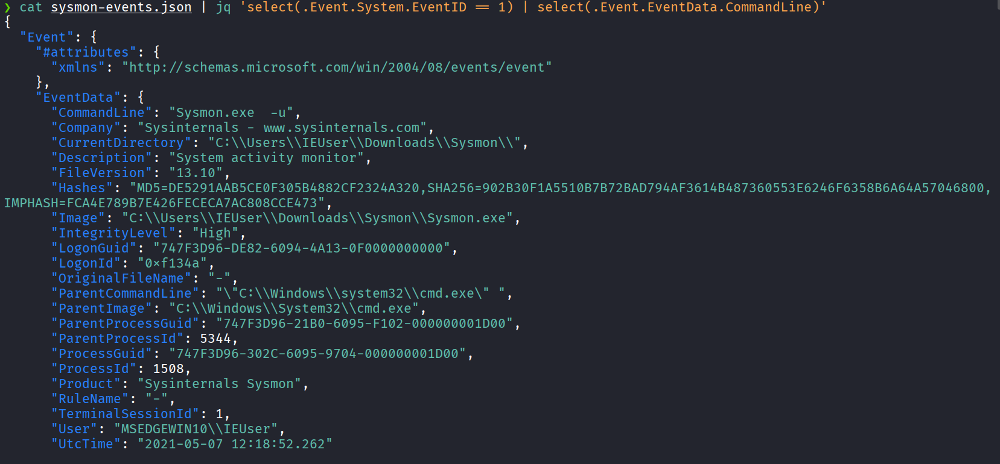
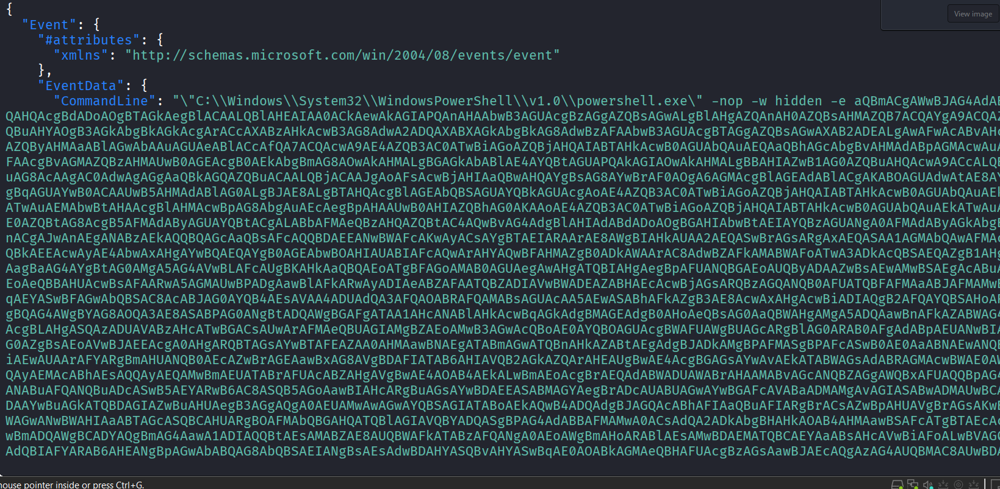
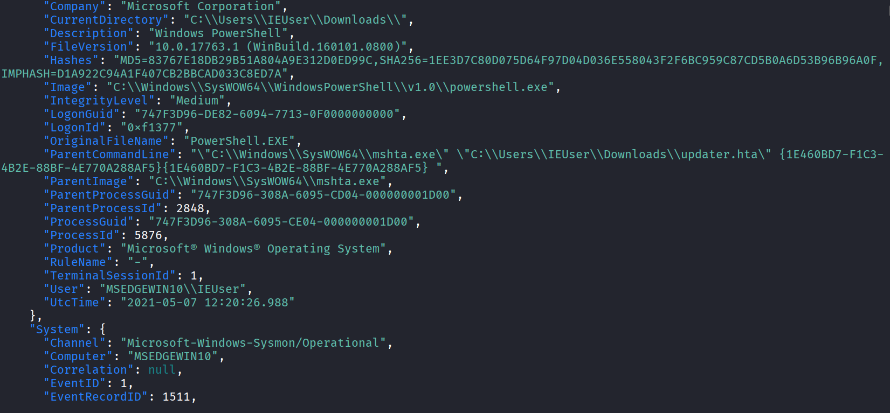
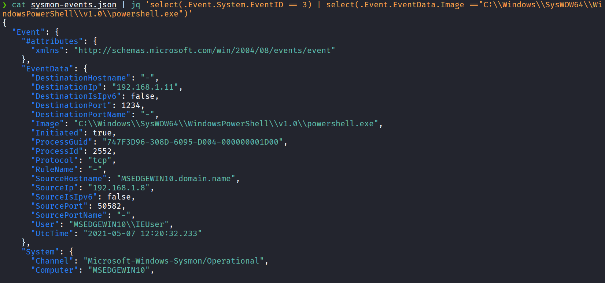
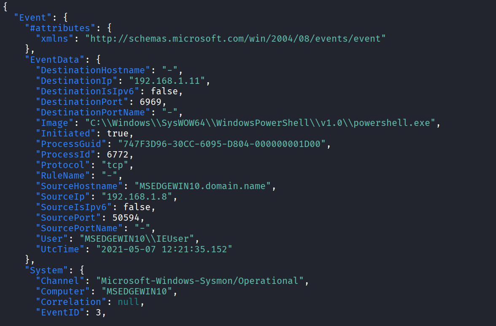
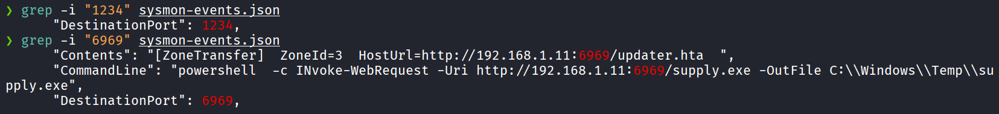

# Question 1) What is the file that gave access to the attacker?

I attemped to use `jq` for filter 

The question is "the file that gave access to the attacker", so i narrowed down with EventID = 1 (process creation) and CommandLine (executable path and arguments)

After some scroll, I found this suspicious event

The long command has flag -nop (no profile) -w hidden (WindowStyle hidden) -e (EncodedCommand)

Look at `"ParentCommandLine": "\"C:\\Windows\\SysWOW64\\mshta.exe\" \"C:\\Users\\IEUser\\Downloads\\updater.hta\" {1E460BD7-F1C3-4B2E-88BF-4E770A288AF5}{1E460BD7-F1C3-4B2E-88BF-4E770A288AF5} ",`

The user downloaded `updater.hta` into the Downloads folder and clicked on it. However, this file was not executed directly but was interpretered by `mshta.exe`. `mshta.exe` read the PowerShell command inside and ran it

Answer: updater.hta

# Question 2) What is the powershell cmdlet used to download the malware file and what is the port?

Cause question ask cmdlet used to download, i narrowed down with this filter

EventID = 3 (TCP/UDP connection), image = powershell

Output are 2 event

Some more filter

Answer: Invoke-WebRequest, 6969