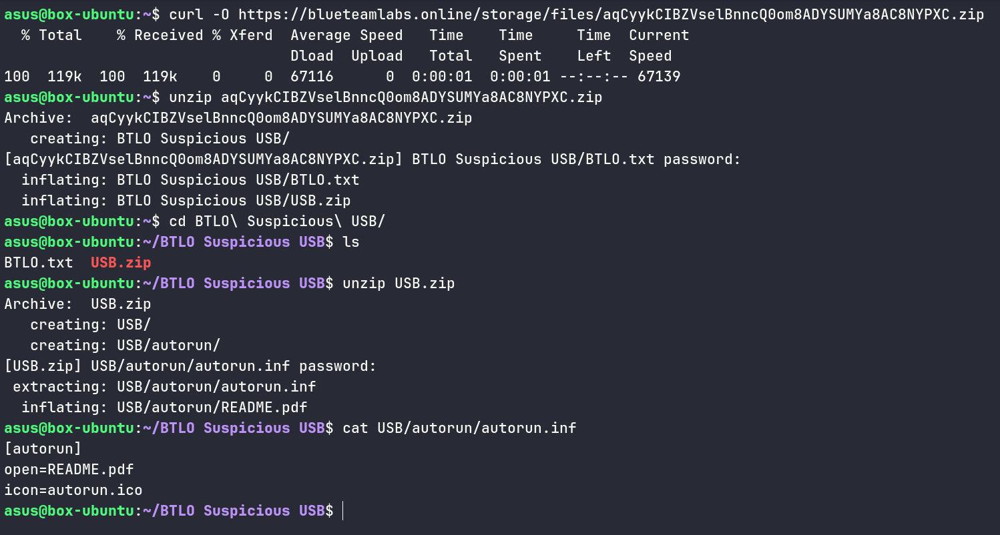
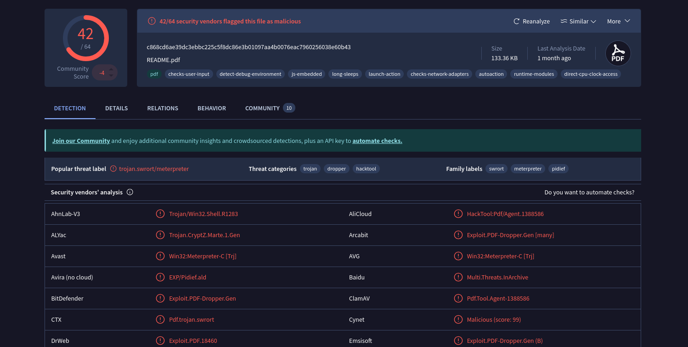
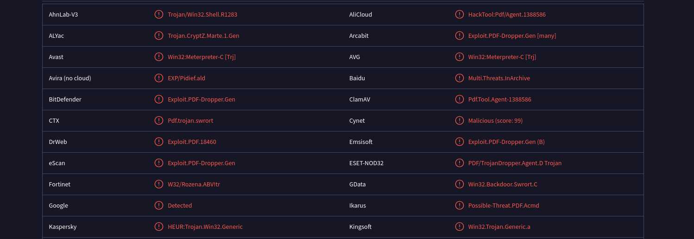
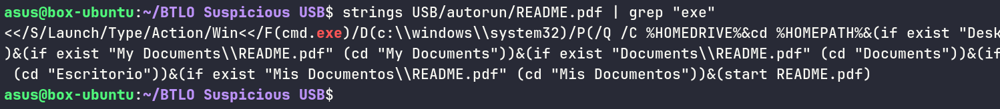
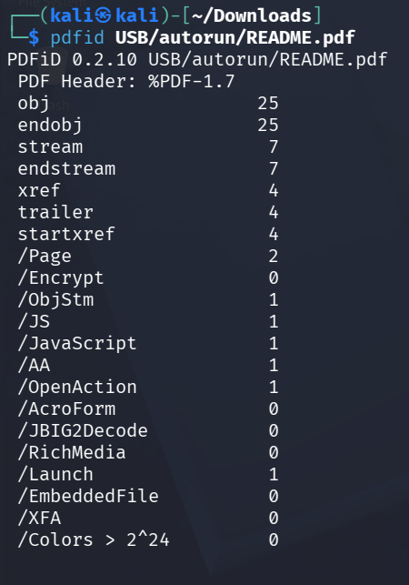

# Question 1: What file is the autorun.inf running?

# Question 2: Does the PDF file pass VirusTotal scan?

To verify whether the PDF file is malicious, we first need to obtain its SHA256 hash and check it against VirusTotal's database.

**Getting SHA256 digest:**

**VirusTotal scan results:**

# Question 3: Does the file have the correct magic number?

**What is a magic number?**

A magic number is a specific sequence of bytes found at the beginning of a file that acts as its unique fingerprint. These bytes help computers and software identify the file type, regardless of the file extension.

**Analysis:**

To verify if the file has the correct magic number for a PDF, we can use the `file` command:

# Question 4: What OS type can the file exploit?

Reviewing the VirusTotal report, we can identify vulnerabilities associated with Win32, indicating that this file targets Windows operating systems.

# Question 6: A Windows executable is mentioned in the PDF file, what is it?

To extract readable content from the file, we can use the `strings` command combined with `grep` to search for the `.exe` keyword, as we're looking for Windows executables.

# Question 7: How many suspicious /OpenAction elements does the file have?

**What is /OpenAction?**

The `/OpenAction` entry in a PDF is a dictionary object within the file's trailer or catalog that defines a specific action to be executed automatically when the document is opened. This can be exploited to trigger malicious behavior.

**Analysis:**

Using the `pdfid` tool to analyze the PDF structure:

